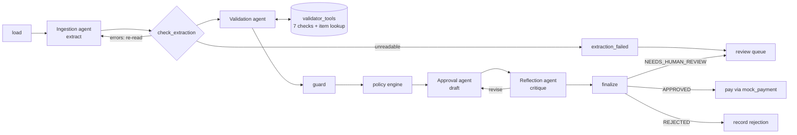

# Acme Corp Invoice Automation: a multi-agent AP pipeline

Acme Corp spends about **$2M a year** processing invoices by hand, with a **30% data-entry error rate** and
**5-day cycles**. This system reads an invoice in any of the formats Acme receives, checks it against
inventory, applies the approval policy with a reflection step, and pays it or records why not.
It does this in seconds, and every decision is logged and explained.

Run live on Grok against the 20 sample invoices, it **blocks 9 (including fraud, overbilling and a hidden $50
overcharge), holds 4 for a person (3 duplicates plus 1 invoice Grok judged risky) and pays 7 automatically**.
That's 80% decided without a human, and nothing is paid twice.

```bash
python -m venv .venv
source .venv/Scripts/activate        # Git Bash; PowerShell: .venv\Scripts\Activate.ps1; macOS/Linux: source .venv/bin/activate
pip install -r requirements.txt

# Fully offline, no API key needed:
python main.py --provider mock --reset-db --invoice_dir=data/invoices
# If you run a batch of multiple invoices, the second run will demonstrate duplicate detection. (add --reset-db for a fresh result)
python main.py --provider mock --invoice_path=data/invoices/invoice_1001.txt

# With Grok (the target model): copy .env.example to .env and set XAI_API_KEY
python main.py --invoice_path=data/invoices/invoice_1001.txt

pytest          # 99 tests, all offline
```

> The case README's example uses `data/invoices/invoice1.txt`, which doesn't exist; the sample files are
> named `invoice_1001.txt` … `invoice_1016.json`. Any path works.

CLI options: `--invoice_path` or `--invoice_dir` (batch, filename order), `--provider grok|mock`,
`--reset-db` (reseed inventory, clear the payment ledger), `--json` (machine-readable output),
`--db-path`, `--output-dir`.

The payment ledger persists between runs, as a real AP system's would: re-running an invoice that was
already paid correctly sends it to review as a `DUPLICATE`. Use `--reset-db` for a clean demo run.

---

## How it works



Built with **LangGraph**. Each box is a graph node. Every node except `validator_tools` (LangGraph's prebuilt
`ToolNode`) writes one structured audit event; tool calls are logged by `validator_agent` (calls requested)
and `guard` (calls made, plus any it had to run itself).

| Stage | Agent / node | What it does | LLM role |
|---|---|---|---|
| 1. Ingestion | **Ingestion agent** | JSON/CSV/XML are parsed in code (exact, free). Free text, emails and PDFs go to Grok with **structured output** (Pydantic `Invoice` schema). Then normalization: OCR fixes (`2O26` → 2026), `Widget A` → `WidgetA`, date formats, string totals. | Extraction |
| | **check_extraction** (self-correction) | Line-item names, quantities, prices and amounts, the subtotal, tax, total and vendor name must all appear in the source document, and line amounts must reconcile. On failure, the specific errors go back to Grok for a re-read (up to 3 attempts). If a re-read returns the same values, the document itself is inconsistent; that's passed on as a finding, not retried forever. | Re-reads |
| 2. Validation | **Validation agent** | Grok runs a **tool-calling** loop over 7 deterministic checks (required fields, inventory, arithmetic, catalog prices, duplicates, FX, fraud signals), plus a `lookup_inventory_item` tool for investigating unknown item names. | Tool use, summary |
| | **guard** | Runs any required check the agent skipped, so findings never depend on the model remembering a tool call. | — |
| 3. Approval | **policy engine** | The approval rules as code (below). | — |
| | **Approval agent** | Drafts APPROVED / NEEDS_HUMAN_REVIEW / REJECTED with a stakeholder-readable rationale (structured output). | Decision, explanation |
| | **Reflection agent** | An auditor persona critiques **every** draft: does it follow policy, cover every finding, and (over $10K) give a VP-level justification? It can send the draft back for revision (up to 2 critique rounds). | Critique |
| | **finalize** | Final outcome = the **stricter** of policy and agent. The agent can escalate; it can never approve what policy rejects. Disagreements are logged. | — |
| 4. Payment | **pay / record_rejection / enqueue_review** | Pays approved invoices through the README's `mock_payment`; records every decision in the ledger; writes held invoices to `review_queue.jsonl`. | **None, by design** |

### Approval policy (`invoice_agents/agents/approver.py`, thresholds in `config.py`)

- Any **REJECT** finding means **REJECTED**: unknown item, zero or insufficient stock (summed across repeated
  lines), non-positive quantity, arithmetic mismatch, non-positive amount, missing vendor, invoice number or
  line items.
- **2+ strong fraud signals** (pressure language, an unusual payment channel such as wire transfer, gift cards
  or crypto, suspicious vendor name, non-date or backdated due date) mean **REJECTED**.
- **REVIEW** findings mean **NEEDS_HUMAN_REVIEW**: duplicate of a paid or pending invoice, unsupported
  currency, payment failure, unreadable document.
- **Over $10,000 USD** gets VP-level review: any risk flag sends the invoice to a human, and the Reflection
  agent requires the rationale to justify the decision explicitly against the threshold.
- **FLAG** findings (price variance, vendor rename, amount just under the threshold, due-date oddities, a single
  strong fraud signal, missing due date) go to the Approval agent, which may escalate.

---

## Design decisions

**How we interpreted "simulate everything locally".** The README asks for Grok through xAI's hosted API,
so the LLM is the one external service it expects us to call; "simulate locally" refers to Acme's
business systems. Those are simulated: banking is the README's `mock_payment`, the inventory/ERP is a local
SQLite `inventory.db`, FX is a static rate table, and there are no real email or vendor integrations. The
LLM backend is swappable through `get_llm()`: **Grok is the default**, and `mock` runs the whole pipeline
offline and deterministically, so anyone can run it without a key or network.

**LLM providers** (`invoice_agents/llm.py`, set with `LLM_PROVIDER` or `--provider`).
Both are LangChain chat models, so agent code calls `.bind_tools()` / `.with_structured_output()`
the same way for each, and another provider would be one more branch in `get_llm()`.
- `grok` (default): `langchain-xai` `ChatXAI`, `XAI_API_KEY`. The README's setup snippet
  (`from xai import Grok`, `model="grok-3"`) is illustrative; it isn't an installable package, and xAI no
  longer lists `grok-3`. We use LangChain's maintained xAI integration and default to `grok-4.7`
  (override with `GROK_MODEL`).
- `mock`: a scripted `BaseChatModel` (`invoice_agents/mock_llm.py`). It replays recorded extractions for
  the sample free-text/PDF invoices (`invoice_agents/mock_fixtures/`), calls every validation tool, and
  writes templated approval/critique outputs. For `invoice_1012.pdf` it scripts a misread first extraction,
  and its critic asks for one revision on invoices over $10K, so **the self-correction and reflection-revision
  loops both run offline**. It only knows the sample invoices; a new free-text invoice can't be extracted and
  goes to review.
- A missing key fails fast with a message pointing to `LLM_PROVIDER=mock`.
- Our code never imports the `openai` package (a test enforces this). It is installed only because
  `langchain-xai` builds on `langchain-openai` internally.

**Code decides the facts; the LLM decides what they mean.** Stock checks, arithmetic, FX and duplicate
detection are plain Python: exact, testable and auditable. Grok handles what code is bad at: reading messy
documents, choosing and sequencing checks, weighing soft risk signals, and explaining decisions. Tools read
the extracted invoice from graph state (LangGraph `InjectedState`) instead of taking it as LLM-typed
arguments, so a model can't alter the numbers it is checking.

**Payment is a safeguard, not a tool.** `mock_payment` is copied verbatim from the case README. It is
called only from a deterministic node, after an approved outcome, with pre-flight checks (vendor present,
amount > 0, not already paid) and a check of the bank's response. No LLM has a payment tool. A failed
payment becomes `NEEDS_HUMAN_REVIEW` with `PAYMENT_FAILED`.

**Inventory is read-only.** Paying an invoice does not decrement stock. This is deliberate: each provided
test invoice is validated against the stock levels the README specifies, giving the same result whatever
order invoices run in. A production system would reserve or decrement stock on payment.

**Duplicates are blocked, never "netted".** The ledger key is the normalized vendor plus invoice number
(`INV 1012` = `INV-1012`). A copy of an invoice that was **paid** or is **awaiting review** goes to a human,
with a diff of what changed. A resubmission of a **rejected** invoice is re-evaluated from scratch. We never
auto-pay the difference on a revision: `1004_revised` cites a PO amendment we have no way to verify.

**Currency** is converted with a static mock FX table (EUR 1.08, GBP 1.27) **before** the $10K rule, and
payment is made in USD. The original amount, currency and rate are kept on the result. A currency not in the
table goes to a human.

**Catalog price check (an extension).** The README's inventory has no prices, so we added a `unit_price`
column (WidgetA $250, WidgetB $500, GadgetX $750). Prices more than 10% above catalog are a **flag**, not a
rejection; discounts are not flagged.

---

## Risks found in the sample data

| File | What's planted | Decision |
|---|---|---|
| 1001 txt | Clean baseline | **Paid** $5,000 |
| 1002 txt | Typos ("INVOCE", "Vndr"); due date = invoice date despite Net 30; GadgetX 20 vs 5 in stock; $15K | **Rejected**: stock (VP review) |
| 1003 txt | "Fraudster LLC", FakeItem (0 stock), $100K, due "yesterday", "URGENT… wire transfer" | **Rejected**: out of stock + 4 fraud signals |
| 1004 json | Total stored as a string | **Paid** $1,890 |
| 1004_revised json | Same invoice number, adds GadgetX ×5 (+$4,050) | **Human review**: duplicate of a paid invoice, with diff |
| 1005 json | GadgetX 8 vs 5; vendor address is 1600 Pennsylvania Ave | **Rejected**: stock |
| 1006 csv | Key/value CSV with repeated `item` keys | **Paid** $2,750 |
| 1007 csv | Over stock on two items; **total 15,525 ≠ 15,635** | **Rejected**: stock + arithmetic |
| 1008 email | Unknown items (SuperGizmo, MegaSprocket); $9,900, just under $10K | **Rejected**: unknown items |
| 1009 json | Empty vendor, no due date, quantity −5, subtotal ≠ lines, negative total | **Rejected**: integrity |
| 1010 txt | WidgetA on two lines (8 + 4 rush at $300); shipping charge | **Paid** $7,185, with a price-variance flag |
| 1011 pdf/txt | The same invoice in two formats | **Paid once**; second copy to review |
| 1012 pdf/txt | OCR noise (`2O26`, `$3,500.O0`, `Widget A`), "formerly FastShip Ltd.", $9,975 | **Grok: held for review** (vendor rename + $25 under the VP threshold); the copy is held as a duplicate of a pending invoice. Policy alone (and the mock) would pay it. |
| 1013 json/pdf | Each line fits stock, but **summed** WidgetA 22 / WidgetB 18 / GadgetX 9 don't; **grand total is $50 more than subtotal + tax** | **Rejected**: stock + arithmetic |
| 1014 xml | EUR | **Paid** $4,455 (€4,125 @ 1.08) |
| 1015 csv | Clean | **Paid** $6,500 |
| 1016 json | WidgetC isn't in inventory | **Rejected**: unknown item |

1012 is the judgement call in the set. Its two flags (vendor rename, amount just under the threshold) are each
weak on their own, so policy approves it and leaves the Approval agent to weigh them. Live Grok escalated it,
reasoning that together they warrant confirming the payee's bank details and whether the amount was kept under
VP scrutiny on purpose. The agent may be stricter than policy, never more lenient, so the hold stands; it shows up
in the audit log as an LLM–policy disagreement.

---

## Business impact

Every batch run ends with a summary. The live Grok run on the sample data:

- **20 invoices in about 12 minutes (median 34 seconds each)**, against a 5-day manual cycle, processing one
  invoice at a time.
- **$30,780 paid automatically, $28,890 held for a human, $204,009 blocked.**
- **80% of invoices decided without a human**; the rest arrive pre-analysed, with a written rationale.
- **3 duplicate payments prevented, 1 fraudulent invoice stopped, 4 invoices with arithmetic errors caught**, including
  a $50 overcharge hidden in a grand total, the kind of error the 30% manual error rate lets through.

The offline mock run makes the same decisions except that it pays 1012, so it reports 8 paid ($40,755), 3 held
($18,915) and 85% decided without a human, in under a second.

The README's baseline has no invoice volume, so we report rates rather than projected dollars. If manual
cost scales with human touches, the share of the $2M removed is roughly the touchless rate. Blocked amounts
are exposure avoided, not savings.

---

## Observability and outputs

| Output | Contents |
|---|---|
| Console | One panel per invoice (fields, findings, decision, rationale, payment), then the batch table and business-impact block |
| `output/audit.jsonl` | One JSON event per graph node: run id, invoice, node, latency, provider/model, tool calls, findings, decisions, LLM–policy disagreements |
| `output/results/<file>.json` | The full result for each invoice |
| `output/review_queue.jsonl` | Invoices waiting for a person, with reasons and rationale |
| `output/batch_summary.json` | Summary metrics plus every result |
| `inventory.db` | Inventory plus the `processed_invoices` ledger (created on first run; gitignored, `scripts/init_db.py` is the source of truth) |

**Error handling.** A bad file, an LLM outage or a parse failure never crashes a batch. Structured invoices
still get a policy decision without the LLM; unreadable ones go to the review queue as `EXTRACTION_FAILED`.

## Testing

`pytest` runs 99 offline tests (mock provider, temporary database):
- **Unit:** normalization (OCR, money, dates, SKUs, dedupe keys), the parsers on all 10 structured samples,
  every validation tool, the policy engine, and the rule that the LLM can't loosen a policy reject.
- **Providers:** Grok constructs with a key, fails fast without one, and binds every agent schema for structured
  output without warnings; unknown providers are rejected; our code never imports `openai`.
- **Agent behaviour:** the self-correction loop recovers 1012's misread on attempt 2; the guard runs checks a
  lazy validator skips; an LLM outage degrades gracefully.
- **Payment:** the stub is called once, with the USD amount, only for approved invoices; never for rejections
  or duplicates; a failed bank response goes to review.
- **End to end:** the whole sample batch is checked against `tests/fixtures/expected_outcomes.yaml`.
- **CLI:** `--json` output parses as JSON for a single invoice and a batch, with the stub's print on stderr.

**What was verified with which model:**
- **Live Grok (`grok-4.7`), full batch, 2 October 2026:** 19 of 20 invoices matched
  `tests/fixtures/expected_outcomes.yaml`. The unedited console output, results and audit log are in
  [`docs/live_grok_run/`](docs/live_grok_run/). The exception is 1012.pdf, which Grok escalated to review (see above);
  that also turned 1012.txt into a duplicate of a *pending* invoice rather than a paid one. There were no errors,
  and the guard never had to run a check the agent skipped.
- **Agent loops seen live:** the reflection loop sent one draft back. On 1007 ($15,525) the critic noted the
  rationale never compared the amount with the $10K threshold, and the revision added that VP-level justification.
  Grok called all 7 checks itself on every invoice, and on the two invoices with unknown items (1008, 1016) it also
  used the optional `lookup_inventory_item` tool to investigate.
  Grok read 1012's OCR noise correctly on the first attempt, so the extraction self-correction loop didn't need to
  fire live; it is exercised offline by the mock (a scripted misread of 1012) and its tests.
- **Offline:** the 99 tests and the expected-outcomes file use the deterministic `mock` provider, so they need no
  key and always give the same results.

## Project layout

```
main.py                         CLI
invoice_agents/
  config.py                     thresholds, FX table, seed data, loop limits
  models.py                     Pydantic contracts (Invoice, Finding, ApprovalDraft, Critique, InvoiceResult)
  llm.py · mock_llm.py          provider factory · offline scripted model
  mock_fixtures/                scripted extractions the mock replays for the sample text/PDF invoices
  prompts.py                    agent system prompts + <context> envelope
  graph.py                      LangGraph wiring, run_invoice / run_batch
  agents/                       state · extractor · validator (+guard) · approver (policy, draft, critique, finalize) · payer
  tools/                        deterministic checks: inventory, arithmetic, pricing, duplicates, fx, fraud, fields
  ingestion/                    loaders (txt/pdf/json/csv/xml) · parsers · normalize
  payment.py                    README mock_payment (verbatim) + guarded execute_payment
  db.py · audit.py · report.py  SQLite inventory/ledger · JSON audit log · rich output + impact metrics
scripts/init_db.py              seed or reset the database
tests/                          99 tests + expected outcomes
docs/live_grok_run/             evidence from the live Grok batch: console output, results, audit log, review queue
requirements.txt · .env.example · pytest.ini
data/                           the case's sample invoices
```

## Limitations and next steps

- Invoices are processed one at a time, about 34 seconds each on live Grok. Running them in parallel would cut
  batch time, but duplicate detection would then need the ledger check and the payment to happen atomically.
- The approved-vendor master (bank details, tax IDs) and PO matching are out of scope. They would turn the
  rename and revision flags into hard checks.
- Human review is a queue file. A production version would use LangGraph interrupts so an approver can resume
  the graph.
- FX rates are static. In production, call a treasury FX service and store the rate used.
- Scanned image-only PDFs are routed to a human. Add OCR (e.g. Tesseract) or a vision model.
